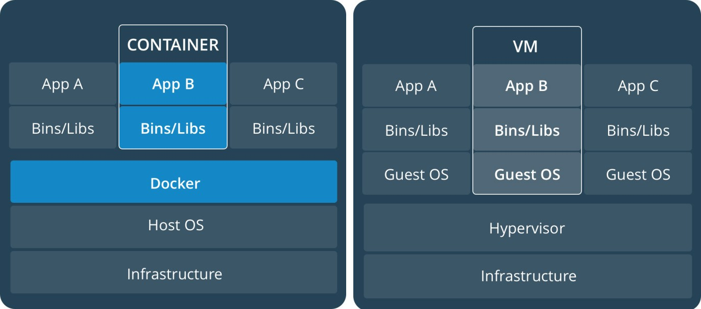

#Средства виртуализации, настройка среды разработки (docker)

## Что такое PHP
PHP - это распространенный язык программирования общего назначения с открытым исходным кодом. PHP специально сконструирован для веб-разработок и его код может внедряться непосредственно в HTML.

PHP крайне прост для освоения, но вместе с тем способен удовлетворить запросы профессиональных программистов.

##Возможности PHP
* Создание скриптов для выполнения на стороне сервера. PHP традиционно и наиболее широко используется именно таким образом. Для этого вам будут необходимы три вещи. Интерпретатор PHP, веб-сервер и браузер. Для того чтобы можно было просматривать результаты выполнения PHP-скриптов в браузере, нужен работающий веб-сервер и установленный PHP. Просмотреть вывод PHP-программы можно в браузере, получив PHP-страницу, сгенерированную сервером. В случае, если вы просто экспериментируете, вы вполне можете использовать свой домашний компьютер вместо сервера.

* Создание скриптов для выполнения в командной строке. Вы можете создать PHP-скрипт, способный запускаться без сервера или браузера. Все, что вам потребуется - парсер PHP. Такой способ использования PHP идеально подходит для скриптов, которые должны выполняться регулярно, например, с помощью помощью планировщика задач.

##Виртуализация
Виртуализация — это процесс создания программного (или виртуального) представления чего-либо, например виртуальных приложений, серверов, хранилищ и сетей.

При виртуализации программное обеспечение используется для имитации наличия оборудования и создания виртуальной компьютерной системы.

Мы рассмотрим виртуализацию **на уровне операционной системы**: работа нескольких экземпляров пространства в рамках одной ОС.

**Контейнер** изначально работает в Linux и разделяет ядро хост-машины с другими контейнерами. Он запускает отдельный процесс, занимая не больше памяти, чем любой другой исполняемый файл, что делает его легким.

В отличии от **виртуальной машины** (VM), которая запускает полноценную операционную систему с виртуальным доступом к ресурсам хост-машины. Таким образом, виртуальная машина предоставляет среду с количество ресурсов больше, чем требуется большинству приложений.

